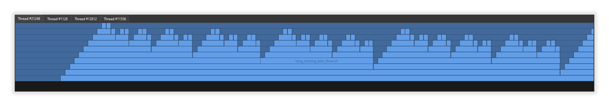

# This is a simple QT timeline visualizer

The initial aim of the project is to provide a way to visualize the profiler data collected by project at
[arsdever/prof](https://github.com/arsdever/prof).

Such an example you can see under `sample` project. Here is the outcome whe the program is run.

